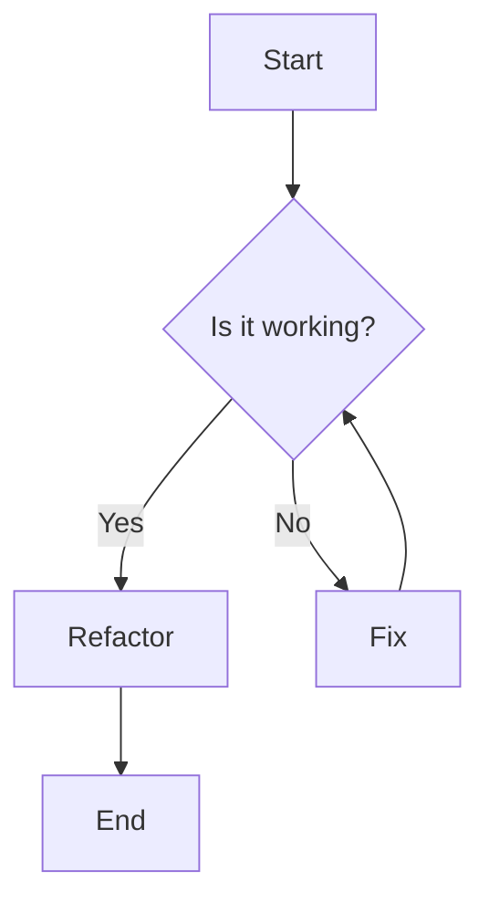
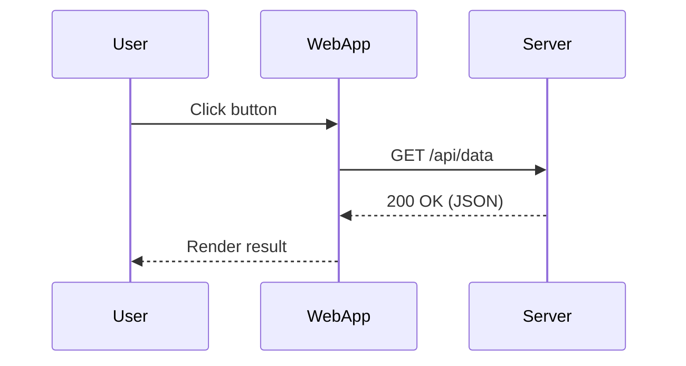
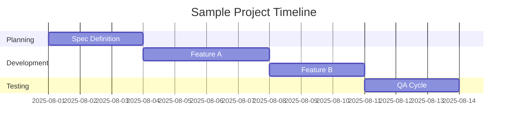

# docsify-gabarit
Gabarit Docsify 


* simple theme
* mermaid
* lightbox
* callout


## Tests

### Image


### Images

* 
* 
* 

### Alerts

> [!NOTE]
> Useful information that users should know, even when skimming content.

> [!TIP]
> Helpful advice for doing things better or more easily.

> [!IMPORTANT]
> Key information users need to know to achieve their goal.

> [!WARNING]
> Urgent info that needs immediate user attention to avoid problems.

> [!CAUTION]
> Advises about risks or negative outcomes of certain actions.

### Mermaid

Flowchart:


Sequence:



Gantt:


### Code Syntax

JavaScript:
```javascript
function greet(name) {
	const msg = `Hello, ${name}!`;
	console.log(msg);
	return msg;
}
greet('World');
```

TypeScript:
```typescript
interface User { id: number; name: string; active?: boolean }
const users: User[] = [{ id: 1, name: 'Alice' }];
function findUser(id: number): User | undefined {
	return users.find(u => u.id === id);
}
```

C#:
```csharp
using System;

class Greeter
{
	static void Main()
	{
		Console.WriteLine("Hello C#");
		var user = new User { Id = 1, Name = "Alice" };
		Console.WriteLine($"Hi {user.Name}");
	}
}

record User
{
	public int Id { get; init; }
	public string Name { get; init; } = string.Empty;
}
```

Python:
```python
from dataclasses import dataclass
from typing import Optional

@dataclass
class User:
		id: int
		name: str
		active: bool = True

def greet(user: Optional[User]):
		if not user:
				return 'No user'
		return f'Hello {user.name}!'
```

Bash:
```bash
set -euo pipefail
for f in *.md; do
	echo "Processing $f"
done
```

JSON:
```json
{
	"name": "example",
	"version": "1.0.0",
	"dependencies": {
		"lodash": "^4.17.21"
	}
}
```

YAML:
```yaml
name: example
env:
	NODE_ENV: production
services:
	api:
		image: my-api:latest
		ports: ["8080:8080"]
```

HTML:
```html
<!DOCTYPE html>
<html lang="en">
<head><meta charset="UTF-8"><title>Test</title></head>
<body>
	<h1>Hello <span class="accent">Docsify</span></h1>
</body>
</html>
```

CSS:
```css
body { font-family: system-ui, sans-serif; }
.accent { color: #2962ff; font-weight: 600; }
```

Markdown inside blockquote:
```markdown
> Quote **bold** `code`
>
> 1. First
> 2. Second
```

Diff:
```diff
diff --git a/app.js b/app.js
--- a/app.js
+++ b/app.js
@@
-console.log('Hello');
+console.log('Hello World');
```

SQL:
```sql
SELECT id, name
FROM users
WHERE active = TRUE
ORDER BY created_at DESC
LIMIT 10;
```

Go:
```go
package main
import "fmt"
func main() { fmt.Println("Hello Go") }
```

GDScript:
```gdscript
extends Node

var count := 0

func _ready():
	print("Hello GDScript")
	_increment()

func _increment():
	count += 1
	print("Count is %d" % count)
```

Rust:
```rust
fn main() {
		println!("Hello Rust");
}
```

Dockerfile:
```dockerfile
FROM node:20-alpine
WORKDIR /app
COPY package*.json ./
RUN npm ci --only=production
COPY . .
CMD ["node","server.js"]
```

TOML:
```toml
[package]
name = "example"
version = "0.1.0"
edition = "2021"
```

Shader Languages:

GLSL:
```glsl
#version 300 es
precision mediump float;
layout(location=0) in vec3 aPos;
void main() {
		gl_Position = vec4(aPos, 1.0);
}
```

HLSL:
```hlsl
struct VSInput { float3 pos : POSITION; };
struct VSOutput { float4 svpos : SV_POSITION; };
VSOutput main(VSInput input) {
		VSOutput o;
		o.svpos = float4(input.pos, 1.0);
		return o;
}
```

WGSL:
```wgsl
@vertex
fn vs_main(@location(0) pos: vec3<f32>) -> @builtin(position) vec4<f32> {
	return vec4<f32>(pos, 1.0);
}

@fragment
fn fs_main() -> @location(0) vec4<f32> {
	return vec4<f32>(1.0, 0.0, 0.0, 1.0);
}
```
